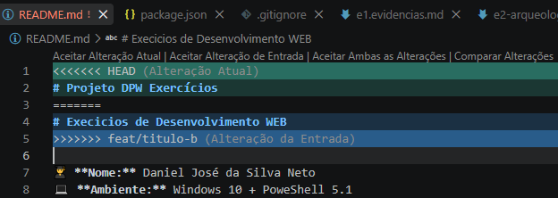

# Evidencias de Conflito de merge 

Saída do git merge que causou o conflito
```powershell 
PS C:\dpw-exercicios> git merge feat/titulo-b
Auto-merging README.md
CONFLICT (content): Merge conflict in README.md
Automatic merge failed; fix conflicts and then commit the result. 
```

# Prova de imagem do conflito
  

# Visualizando o Grafo das branches 
apos realiza o comando: git log --graph --oneline -all

```powershell
...skipping...
* f5a7f93 (feat/titulo-b) Alteração do nome do titulo dos exercicios
| * cc7a1c5 (HEAD -> main, feat/titulo-a) ALteração da primeira linha do README.md na branch titulo-a
|/  
*   1c632d8 (origin/main) Merge branch 'main' of https://github.com/danielneyo/dpw-exercicios
|\  
| * ac47ef0 Update e1.evidencias.md explicação sobre a pergunta
| * 113a6c8 corrigindo o formato do link
| * 9bbc6ce Update e1.evidencias.md no formato do link
| * dde30c7 Update e1.evidencias.md adicionando o link permanente
| * 6e47e90 Update .gitignore  incluindo o link permanente
* | ee8ff1d Adicionando evidências do exercício e2-arqueologia
|/  
* cc6b916 Atualiza evidencias do ambiente reprodutível
* 7907304 Adiciona evidencias do reprodutível
* e66558d Configuração inicial do ambiente reprodutível 
``` 

# Link Permanente 
[commit de resolução do conflito](https://github.com/danielneyo/dpw-exercicios/commit/813b804eff71bd4f231454ba2095222928c4428f)

[Grafo do Repositorio(Network)](https://github.com/danielneyo/dpw-exercicios/network)

# Respondendo a Pergunta 
O git não conseguiu resolver o conflito sozinho porque ambas as branches alteraram a mesma linha do arquivo README.md
isso faz com que o git tenha que descidir qual ateração escolher , mais como git não tem como descidir qual escolher 
qual alteração escoher ele pausa o processo de marge e insere um marcador de conflito para que o desenvolvedor resolva qual escolher. coloquei uma imagem acima para servi de exemplo. 
